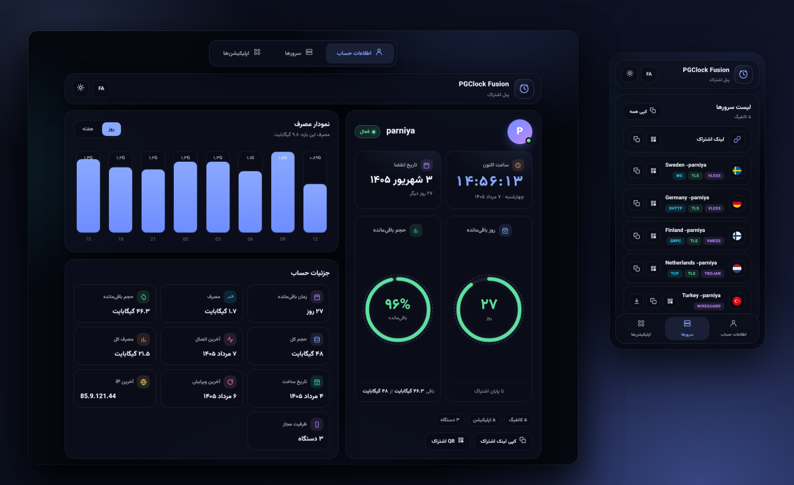

<div align="center">
  
</div>

<h1 align="center">PGClock Fusion</h1>

<p align="center">
  A three-tab subscription page for Pasarguard — live clock, usage chart and custom branding
</p>

<p align="center">
  <b>English</b> ·
  <a href="README.fa.md">فارسی</a>
</p>

<p align="center">
  <a href="#automatic-installation">Install</a> ·
  <a href="#manual-installation">Manual install</a> ·
  <a href="#branding">Branding</a> ·
  <a href="#panel-settings">Panel settings</a> ·
  <a href="#changelog">Changelog</a>
</p>

---

## Features

- Three separate tabs: **Account** · **Servers** · **Apps**
- Live clock and date in both Jalali and Gregorian calendars
- "Days left" and "Data left" rings with status colouring
- Daily/weekly usage chart pulled from the panel API
- Account detail cards (total usage, last connection, last IP, device capacity and more)
- Handles unlimited (∞), expired and limited accounts
- Copy, QR code and WireGuard download per config, plus an SVG country flag that renders identically on every OS — Windows included
- **FA / EN** with automatic RTL/LTR, and **dark / light** themes
- Custom brand name, subtitle and logo (wired into the install script)
- Automatic lite mode (perf-lite) on low-end devices
- A single HTML file — no Node.js, no build step

---

## Automatic installation

On an **Ubuntu** server with Pasarguard already installed:

```bash
curl -fsSL https://raw.githubusercontent.com/Pasham0/PGClockFusion/main/install.sh -o /tmp/pgclock-install.sh && sudo bash /tmp/pgclock-install.sh
```

Or:

```bash
wget -qO /tmp/pgclock-install.sh https://raw.githubusercontent.com/Pasham0/PGClockFusion/main/install.sh && sudo bash /tmp/pgclock-install.sh
```

The installer asks whether you want to customise the branding; press Enter to keep the defaults.

### What the script does

1. (Optional) collects a brand name, subtitle and logo, then patches `index.html` for you
2. Writes the template to:

```text
/var/lib/pasarguard/templates/subscription/index.html
```

3. Updates `/opt/pasarguard/.env`:

```env
CUSTOM_TEMPLATES_DIRECTORY="/var/lib/pasarguard/templates/"
SUBSCRIPTION_PAGE_TEMPLATE="subscription/index.html"
```

4. Runs `pasarguard restart`

> **Requirements:** `wget`, `curl`, `python3`

---

## Manual installation

### 1. Download the template

```bash
sudo mkdir -p /var/lib/pasarguard/templates/subscription/
sudo wget -N -O /var/lib/pasarguard/templates/subscription/index.html \
  https://raw.githubusercontent.com/Pasham0/PGClockFusion/main/index.html
```

### 2. Configure Pasarguard

```bash
sudo nano /opt/pasarguard/.env
```

Add or update:

```env
CUSTOM_TEMPLATES_DIRECTORY="/var/lib/pasarguard/templates/"
SUBSCRIPTION_PAGE_TEMPLATE="subscription/index.html"
```

### 3. Restart

```bash
sudo pasarguard restart
```

---

## Branding

The installer handles this for you. To edit it by hand, find this object near the top of `index.html`:

```javascript
var DEFAULT_BRAND = {
  name: "PGClock Fusion",
  subtitle: { fa: "پنل اشتراک", en: "Subscription panel" },
  logoUrl: ""
};
```

- `name` — brand name, shown in the header
- `subtitle.fa` / `subtitle.en` — subtitle per language
- `logoUrl` — an `https://` URL for your logo; leave it empty to fall back to the default icon

**Template contract (keep these keys stable):** the installer looks for `DEFAULT_BRAND` with the fields `name`, `subtitle` and `logoUrl`.

---

## Panel settings

1. Pasarguard panel → **Settings → Subscription**
2. Edit **announcement** and **announcement link**
3. Add or edit entries in the apps section

---

## Changelog

### v1.3.0

- **The account card now stretches to the full height of the column beside it** — previously it stopped wherever its content ended, leaving a ragged bottom edge
- The "days/data left" ring centres itself in the leftover space; the title stays pinned to the top and the footer to the bottom
- Desktop only (≥860px) — mobile is unchanged

### v1.2.0

- **Desktop layout redesigned**: the bottom bar becomes a **segmented tab bar at the top of the page**
- Maximum page width on desktop raised to 1280px
- The account column and the chart/details column swapped places (5fr / 7fr)
- The account detail grids use `auto-fit` against the *column* width rather than the window width — values no longer clip between 860px and 1180px
- Server and app grids go to three columns at ≥1180px
- Value labels on the chart bars are horizontal on desktop (they used to be vertical)
- App and QR dialogs open centred on desktop instead of sliding up from the bottom

### v1.1.0

- **Circular SVG flags** instead of emoji, via [circle-flags](https://github.com/HatScripts/circle-flags) — colourful and consistent on Windows too
- Dropped the flag polyfill font (Twemoji) — roughly 600KB less to download
- A flag emoji typed into a server name by the admin is converted to an SVG flag automatically
- Long values in the account detail cards wrap instead of being clipped
- The account detail grid is back to two columns on desktop so values fit

### v1.0.1

- Responsive grids for desktop

### v1.0.0

- Initial release

---

## License

[MIT](LICENSE)
